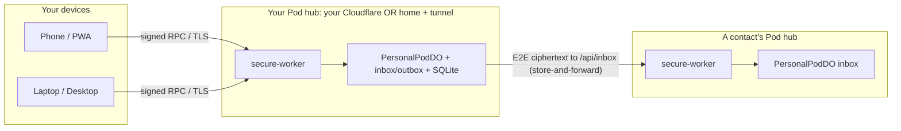

# The podlink pipeline

podlink is a personal, end-to-end encrypted pipeline with two flows over the
same hub:

1. **Your devices ↔ your own Pod** — signed RPC over TLS.
2. **You ↔ a contact** — E2E-encrypted messages delivered **directly pod-to-pod**.

There is no cooperative, no aggregation operator, no shared relay, and no AI.

## Hub modes

| | Cloud | Home |
| --- | --- | --- |
| Where | Your Cloudflare account (`*.workers.dev`) | Your machine (`workerd`) |
| Reachability | Native Workers TLS, always-on | Cloudflare Tunnel, no open inbound port |
| Setup | `podlink setup --cloud` | `podlink setup --home` (or desktop Settings → Home tunnel) |
| Best for | Most people; easy store-and-forward | Maximum on-device data control |

Both modes run the **same** worker (`forum-pod-airlock`) and the **same** PWA.

## Identity (pseudonymous)

Your identity is derived deterministically from a 12-word BIP39 recovery phrase:

- **Ed25519** signing key — message signatures, session binding, and the
  pod-local **recovery key**.
- **X25519** box key — ECDH key agreement for encryption.
- **Handle** — `pk-<first 16 hex of sha256(ed25519 pubkey)>`.
- **Pod URL** — where your Pod lives.

A **contact card** = `{ handle, displayName?, podUrl, ed, x }`, shared
out-of-band as a `podlink://contact/…` invite (QR or text). No real-world PII.

## Message crypto (`forum-pod/src/messaging/crypto.js`)

- **1:1:** `X25519 static-static ECDH → HKDF-SHA256 → XChaCha20-Poly1305` AEAD.
  The sender's X25519 public key travels in the envelope so the recipient can
  derive the shared key.
- **Group:** a random 32-byte group key + XChaCha20-Poly1305; the group key is
  delivered to each member as a 1:1 message (no server-side group state).
- **Authenticity:** every envelope carries an **Ed25519 detached signature** over
  its canonical core. The recipient Pod verifies this signature on `/api/inbox`
  before storing; the recipient device verifies it again before decrypting.
- Plaintext exists only on the sender's and recipient's devices. Pods and the
  transport handle ciphertext only.

The sender keeps a **self-copy** sealed to their own key so message history is
readable across their own devices.

## Transport (`pod-do.js` + `inbox-routes.js`)

- **Device → own Pod:** `POST /api/pod` with an Ed25519-signed bundle bound to
  the device key (`sessionId = pubkey:sha256(publicKeyHex)`). The DO enforces a
  device **allowlist** and routes by a stable `podId` so all of your devices hit
  the same DO.
- **Inbound mail:** public `POST /api/inbox` accepts **only** valid signed E2E
  envelopes, looks up the owner (by handle for DMs) in D1, and stores the
  ciphertext into the owner's DO.
- **Store-and-forward:** the sender's DO holds an **outbox**; on PUT it schedules
  delivery (alarm) and retries with exponential backoff until the recipient Pod
  acks — covering briefly-offline home pods.

DO tables: `authorized_devices`, `contacts`, `groups`, `messages`, `outbox`,
`pod_meta`. The worker's D1 holds `pod_owner` (handle → pod_id routing) plus
WebAuthn/rate-limit tables, all created at runtime.

## Multi-device & recovery

- The first device to reach a fresh Pod TOFU-enrolls as **owner**; its key and
  the **recovery public key** (your identity Ed25519 key) are stored in `pod_meta`.
- A new device re-derives your identity from the phrase, then calls
  `PUT /devices/recover` signed by the recovery key. The DO verifies the
  signature against the enrolled `recovery_pub` and enrolls the new device.
- Other devices can also be authorized directly by their signing key
  (Settings → Paired devices).

## Security posture summary

- No open inbound port at home (outbound tunnel only).
- Ciphertext-only at the Pod and in transit; PII never leaves the device.
- Pseudonymous identity; user-controlled display name.
- Allowlisted, signed device access; signature-verified inbound mail.
- No third party, no aggregation, **no AI**.
